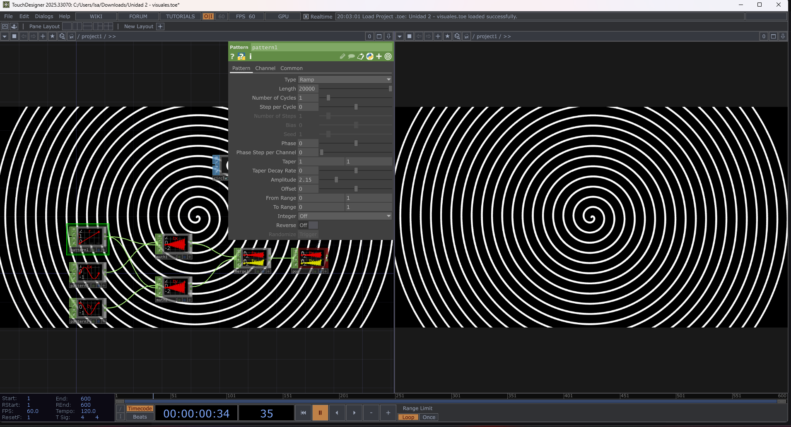
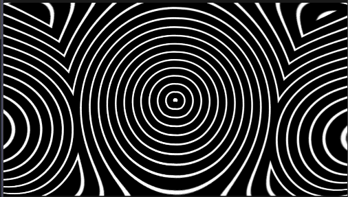
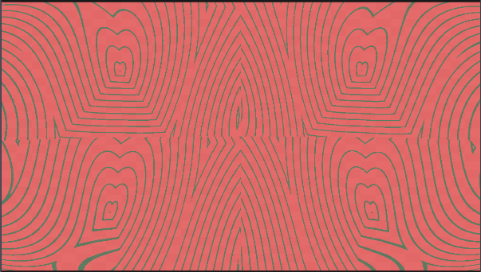

# Bitácora de Desarrollo - Unidad 2: Visuales Generativas y Parametrizables

---

## 1. Intención y Concepto
Este proyecto explora la creación de un sistema visual generativo en tiempo real basado en patrones geométricos y simetrías dinámicas. La propuesta busca pasar de la generación de una imagen estática al diseño de **relaciones paramétricas**, donde el tiempo y las funciones matemáticas determinan la evolución de la forma y el color.

> *"La unidad de diseño ya no es la imagen, sino la relación que produce la imagen."*

---

## 2. Definición del Sistema (Input - Process - Output)

El sistema opera bajo la arquitectura procedural **Input-Process-Output**:

### 📥 Entradas (Inputs / Parámetros)
* **Tiempo (`absTime.seconds`):** Actúa como el reloj global del sistema, haciendo modular la fase de la rampa de color y la animación de los patrones en tiempo real.
* **Frecuencia y Amplitud (CHOPs):** Valores numéricos que controlan la densidad y la velocidad de deformación del sistema.

### ⚙️ Procesamiento (Process)
1. **Generación de Forma (CHOPs):** Se generan tres señales mediante nodos `Pattern` (seno, coseno y rampa) agrupados con nodos `Math` y `Merge` para crear una trayectoria helicoidal/espiral.
2. **Instanciación (SOPs/COMPs):** Se duplica la geometría sobre la posición de los puntos calculados.
3. **Composición y Deformación (TOPs):** Se aplican simetrías con nodos `Mirror` y repeticiones infinitas con `Tile`, seguidas de un mapa de desplazamiento (`Displace`) para generar el efecto fluido.
4. **Modulación Cromática:** Se utiliza un nodo `Ramp TOP` cuya fase oscila con el tiempo, conectado a un nodo `Lookup TOP` para remapear los tonos en escala de grises hacia una paleta de color personalizada.

### 📤 Salida (Output)
* Sistema visual generativo interactivo renderizado a 60 FPS en tiempo real.

---

## 3. Diagrama de Nodos y Estructura

A continuación se muestra la red de nodos desarrollada en TouchDesigner:

*Figura 1: Estructura general del sistema en TouchDesigner.*

---

## 4. Evolución Visual y Pruebas

### Fase 1: Estructura en Blanco y Negro (Base Procedural)
En la primera etapa se construyó la matriz de movimiento y las transformaciones de espejo sin información de color.

*Figura 2: Generación del patrón base.*

*Figura 3: Ajustes de deformación y simetría.*

### Fase 2: Aplicación de Paleta Cromática y Oscilación
Se integró la rampa de color animada para convertir la estructura geométrica en una experiencia visual dinámica.

*Figura 4: Resultado final con modulación de color activada.*

---

## 5. Demostración en Vivo (Video)

A continuación se muestra el comportamiento dinámico del sistema en ejecución:

<video src="https://github.com/user-attachments/assets/1304454e-eb8c-48d3-b901-908d0c26418e"></video>

---

## 6. Conclusiones y Decisiones de Diseño
* La utilización de nodos `CHOP` para coordinar posiciones matemáticas permitió una estructura fluida y ligera para el cómputo en GPU.
* El remapeo de color mediante `Lookup` y `Ramp` demostró ser una estrategia eficiente para modificar dramáticamente la atmósfera de la pieza sin alterar la complejidad de la geometría subyacente.
